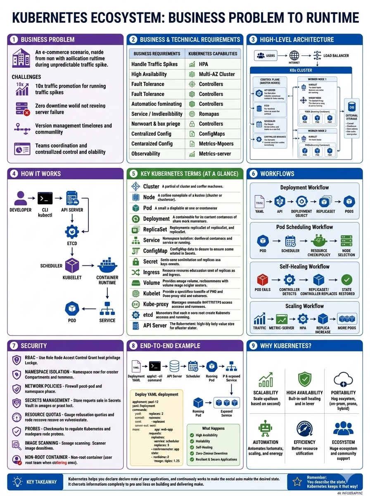

# Kubernetes: Request to Runtime

An interactive, animated walkthrough of the Kubernetes architecture and the complete deployment lifecycle. This project breaks down the full journey — from business problem to running, self-healing service — into 23 clear, visual stages across three parts.

🔗 **[View Live Demo](https://elixirman.github.io/K8-production-process/)**

[

## ✨ Features

- **23 Interactive Stages in 3 Parts:**
  - **Part A — Architecture (00–11):** business problem, requirements mapping, control plane, worker nodes, networking, storage, CI/CD, autoscaling, security, observability, and day-2 operations.
  - **Part B — Processes (12–19):** deployment, pod scheduling, self-healing, scaling, and service discovery, plus a full YAML-to-runtime worked example and a benefits recap.
  - **Part C — Reference Model (20–22):** the 9-category architecture map, the 3-layer YAML-to-cluster flow, and a real, ready-to-apply sample project structure.
- **Smooth SVG Animations:** Visualizes data flow, component interactions, and architectural layers.
- **Responsive Design:** Adapts seamlessly to different screen sizes.
- **Dark Mode UI:** Built with a modern, developer-friendly dark theme.
- **Zero Dependencies:** Built entirely with vanilla HTML, CSS, and JavaScript.

## 🛠️ Tech Stack

- **Frontend:** HTML5, CSS3, Vanilla JavaScript
- **Containerization:** Docker (Nginx:alpine)
- **Hosting:** GitHub Pages

## Running Locally with Docker

If you want to run or test this project locally using Docker, follow these steps:

1. **Build the Docker image:**

```
docker build -t k8s-app .
```

2. **Run the container:**

```
docker run -d --name k8s-animation -p 8080:80 k8s-app
```

3. **View the app:**

Open your browser and navigate to http://localhost:8080
(To stop the container later, run: `docker stop k8s-animation` and `docker rm k8s-animation`)

## 📂 Project Structure

```
K8-production-process/
├── index.html      # Main application file (HTML, CSS, JS)
├── Dockerfile       # Docker configuration for Nginx
└── README.md        # Project documentation
```

## Deployment

This project is automatically deployed and hosted for free using GitHub Pages. Any changes pushed to the `main` branch will automatically trigger a rebuild and update the live site within a few minutes.

## 📄 License

This project is open-source and available for educational purposes.
